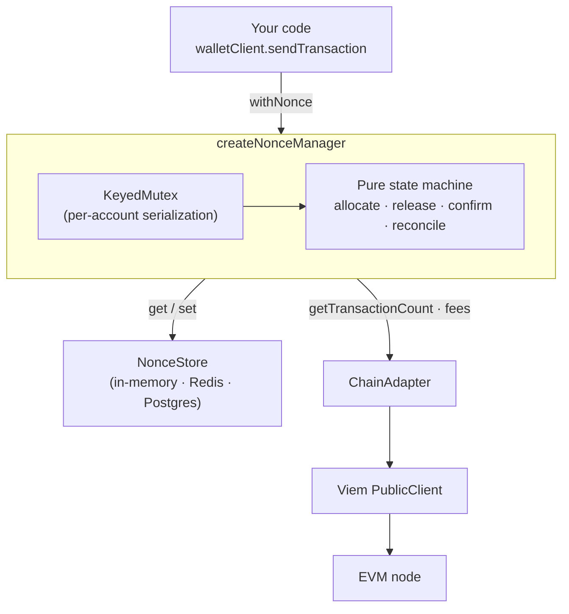

# @arthel/evm-nonce-manager

[](https://github.com/arthel-labs/evm-nonce-manager/actions/workflows/ci.yml)
[](./LICENSE)

Reliable **EVM transaction nonce management** for [Viem](https://viem.sh). It does
one thing well: hand out transaction nonces that stay correct under concurrency
and survive the failure modes that make naive nonce handling break.

It is **not** a wallet, signer, or transaction-sending framework. You keep using
Viem's account/client abstractions to sign and send; this library only owns the
nonce.

```ts
const hash = await manager.withNonce(account, async (nonce) => {
  return walletClient.sendTransaction({ ...tx, nonce });
});
```

---

## Why this exists

On EVM chains every account's transactions must have **strictly sequential
nonces**. In any system that sends transactions — especially concurrently —
naive nonce handling breaks in ways that are painful and money-adjacent:

| Failure mode | What happens without a nonce manager |
| --- | --- |
| **Concurrent sends** | Two parallel sends read the same nonce → one tx is rejected. |
| **Failed broadcast** | A nonce is "used" but the tx never lands → a permanent **gap** forms and *every* later tx gets stuck behind it. |
| **Stuck pending tx** | An underpriced tx sits pending forever → everything queues behind it. |
| **Process restart** | In-memory nonce state is lost and drifts from chain reality. |
| **Chain reorg** | The confirmed nonce effectively moves backwards. |

A correct nonce manager makes these **survivable instead of catastrophic**.
That recovery behavior — not the happy path — is the point of this library.

---

## Install

```bash
npm install @arthel/evm-nonce-manager viem
```

`viem` is a peer dependency (`^2`).

---

## Quickstart

```ts
import { createPublicClient, createWalletClient, http } from 'viem';
import { privateKeyToAccount } from 'viem/accounts';
import { mainnet } from 'viem/chains'; // use a testnet / local chain!
import { createNonceManager } from '@arthel/evm-nonce-manager';

const transport = http(RPC_URL);
const publicClient = createPublicClient({ chain, transport });
const account = privateKeyToAccount(PRIVATE_KEY);
const walletClient = createWalletClient({ chain, account, transport });

const manager = createNonceManager({ client: publicClient });

// The headline primitive. Allocates a nonce, runs your callback, and releases
// the nonce automatically if the callback throws before the tx takes hold.
const hash = await manager.withNonce(account.address, async (nonce) => {
  return walletClient.sendTransaction({
    account,
    to: '0x…',
    value: 1n,
    nonce,
  });
});
```

Most users never need anything beyond `withNonce`.

### See it work in 30 seconds

```bash
anvil                 # terminal 1 — a local devnet (Foundry)
npm run example       # terminal 2 — fires 25 concurrent txs, prints nonce ordering
```

```
Distinct nonces : 25/25
Contiguous      : yes ✅
Chain nonce now : 25 (expected 25)
```

---

## API reference

### `createNonceManager(options)`

| Option | Type | Default | Description |
| --- | --- | --- | --- |
| `client` | `PublicClient` | — | Viem public client. Its `chain.id` keys all state. |
| `store` | `NonceStore` | `InMemoryNonceStore` | Persistence backend (see below). |
| `reconcileOnStart` | `boolean` | `true` | Reconcile persisted state against the chain on first use of each account. |
| `reconcileIntervalMs` | `number` | off | Periodically reconcile every seen account. Call `stop()` on shutdown. |
| `initBlockTag` | `'pending' \| 'latest'` | `'pending'` | Seed source for the allocation watermark. |
| `defaultFeeBumpPercent` | `number` | `10` | Default fee bump for replacements/cancellations. |

### Methods

```ts
// Headline ergonomic — allocate, run, auto-release on failure.
manager.withNonce(account, async (nonce) => Promise<T>): Promise<T>

// Lower-level controls (most users won't need these):
manager.peek(account)              // next nonce without consuming
manager.allocate(account)          // consume next nonce
manager.release(account, nonce)    // return an unused nonce for reuse
manager.confirm(account, nonce)    // mark confirmed, advance the pointer
manager.resync(account)            // reconcile with chain → NonceStatus
manager.status(account)            // { confirmed, allocated, inFlight }

// Stuck-tx helpers — return a ready-to-sign request with bumped fees:
manager.buildReplacement(account, nonce, original, { feeBumpPercent })
manager.buildCancellation(account, nonce, { feeBumpPercent })

manager.stop()                     // clear the reconcile interval, if any
```

`status` returns `{ confirmed, allocated, inFlight }`:

- `confirmed` — next nonce the chain expects for a brand-new confirmed tx.
- `allocated` — the high-water mark (next *fresh* nonce that would be handed out).
- `inFlight` — nonces handed out but neither confirmed nor released.

### Errors

All thrown errors extend `NonceManagerError`:

- `NonceTooLowError` — chain moved past the nonce; the manager resyncs.
- `NonceTooHighError` — a gap exists; recoverable via `resync`.
- `InvalidNonceError` — a caller-side bug (e.g. releasing a never-allocated nonce).

---

## Architecture



### Decisions

- **Pure state machine, isolated I/O.** Every allocation rule lives in a
  network-free state machine (`src/core/state-machine.ts`) that takes a state
  and returns a new one. All chain access is funneled through one thin
  `ChainAdapter`. This is what makes the failure behavior exhaustively
  unit-testable without a node.
- **Per-account serialization, cross-account parallelism.** A `KeyedMutex`
  serializes state transitions for a single `(chainId, account)` so allocation
  is race-free, while different accounts proceed fully in parallel. Idle locks
  are garbage-collected so a long-lived manager doesn't leak.
- **Reuse before extend.** A failed allocation is returned to a *released* set
  and reused before the watermark advances, so a failed broadcast never leaves
  a permanent gap.
- **`confirm` only moves forward.** On EVM, a tx with nonce *n* can only be
  mined once every nonce `< n` is mined, so observing *n* confirmed advances the
  pointer to `n + 1`. Reorg regressions are handled by `reconcile`, not
  `confirm`, keeping the model simple and correct.
- **Async all the way down.** `peek`/`allocate`/… return promises so a
  `NonceStore` backed by Redis/Postgres drops in without touching core logic.
- **Multi-chain by construction.** State is keyed by `(chainId, address)`.

### Pluggable persistence

The default `InMemoryNonceStore` loses state on restart — fine for tests, not
for production. The `NonceStore` interface is the extension point:

```ts
interface NonceStore {
  get(key: NonceStateKey): Promise<PersistedNonceState | undefined>;
  set(key: NonceStateKey, state: PersistedNonceState): Promise<void>;
}
```

Implement it against Redis or Postgres and pass it as `store`. Nothing else
changes — concurrency safety stays with the manager's per-account mutex, so your
store only needs `get`/`set`. (Redis/Postgres stores are intentionally **not**
shipped here; this library stays scoped to nonce logic.)

```ts
const manager = createNonceManager({ client, store: new RedisNonceStore(redis) });
```

On restart, `reconcileOnStart` rehydrates from the store and reconciles against
the chain on first use of each account.

---

## Edge cases handled

Each of these is covered by a test (`test/` for the state machine, `test/integration/`
against Anvil):

- **Concurrent allocation** — 50 parallel `allocate` calls return 50 distinct,
  contiguous, ordered nonces.
- **Broadcast failure inside `withNonce`** — the nonce is released and the next
  allocation reuses it; no gap.
- **`nonce too low`** — the manager resyncs against the chain and recovers; the
  error surfaces as `NonceTooLowError`.
- **`nonce too high` / gap** — surfaced as `NonceTooHighError`, recoverable via
  `resync`.
- **Stuck pending tx** — `buildReplacement` produces a same-nonce tx with a
  valid (≥10%) fee bump; `buildCancellation` produces a 0-value self-send to
  evict it.
- **Process restart** — state rehydrates from the store and reconciles with the
  chain.
- **Independent accounts** — proceed in parallel without blocking each other.
- **Reorg** — the confirmed nonce regresses without corrupting allocation state.

---

## Development

```bash
npm install
npm run lint          # eslint + prettier
npm run typecheck     # tsc --noEmit
npm test              # unit tests (no node required)
npm run test:integration   # Anvil integration tests (needs Foundry)
npm run build         # dual ESM + CJS + types
```

---

## Safety

This library **never touches mainnet or real funds**, and neither should your
tests or examples. The examples and integration tests run exclusively against a
local Anvil node. Use a testnet or local devnet when integrating.

---

## License

[MIT](./LICENSE) © Arthel Labs
